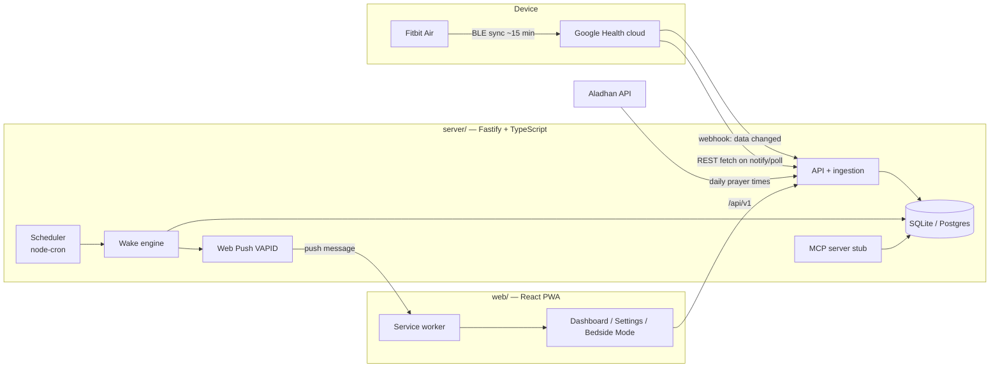
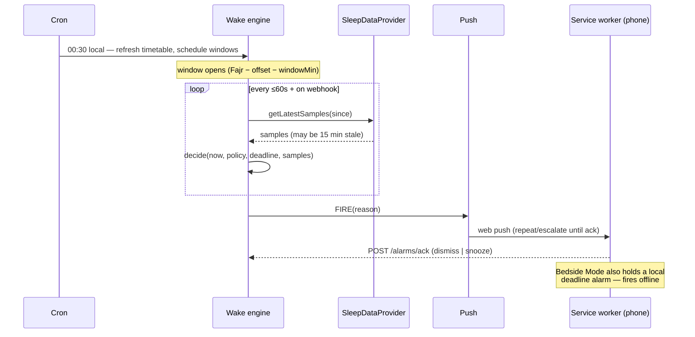

# Architecture

## 1. System overview



Two deployable pieces, one repo (npm workspaces):

- **`server/`** — Fastify HTTP API, data ingestion, wake engine, push sender,
  MCP stub. State in SQLite (dev) with a thin data-access layer that ports to
  Postgres unchanged.
- **`web/`** — React + Vite installable PWA. Service worker handles push and
  notification actions; Bedside Mode schedules a client-side fallback alarm so
  the deadline fires even fully offline.

## 2. Server modules

| Module | Path | Responsibility |
|--------|------|----------------|
| providers | `server/src/providers/` | `SleepDataProvider` interface; `mock/` (simulator) and `googleHealth/` (stub until API approval) implementations |
| prayer | `server/src/prayer/` | Aladhan client, timetable cache, method/madhab config |
| wake | `server/src/wake/` | Pure decision function + window scheduler; emits alarm events |
| push | `server/src/push/` | Web Push (VAPID) sender, escalation/repeat logic, subscription store |
| api | `server/src/api/` | `/api/v1` REST routes + Google Health webhook receiver |
| mcp | `server/src/mcp/` | MCP tools mapped onto the same services as REST |
| db | `server/src/db/` | SQL schema + minimal data-access layer |

### The provider seam (key design decision)

Google Health API access needs developer approval, so **nothing outside
`providers/` may know which provider is active**:

```ts
interface SleepDataProvider {
  getLatestSamples(userId: string, since: Date): Promise<SleepSample[]>;
  getSessions(userId: string, range: DateRange): Promise<SleepSession[]>;
  subscribe?(userId: string): Promise<void>;   // webhook registration (real provider)
}
```

The **mock provider** simulates a full night: sleep-cycle generator
(latency → cycles of deep/light/REM with realistic durations), configurable
**sync lag** (data becomes visible only N minutes after it "happened", mimicking
the 15-min BLE sync), and a **time-acceleration factor** so a whole night plays
out in seconds for tests and demos.

### Wake engine

Split for testability:

- `decide(now, policy, deadline, samples): Decision` — **pure function**, no IO.
  Implements SPEC §4 (deadline check → staleness check → stage match → HR-rise
  → wait). Trivial to unit test.
- `WakeScheduler` — for each enabled policy, computes tonight's window from the
  cached timetable, then ticks (cron + webhook-triggered) calling `decide` and
  dispatching `FIRE` to the push module + event log.

## 3. Data model

All timestamps are ISO-8601 UTC; rows carry `tz_offset_min` where local wall
time matters. Units are explicit in column names.

```
users             id, email, tz (IANA), lat, lng, calc_method, madhab, created_at
oauth_tokens      user_id, provider, access_token, refresh_token, expires_at
sleep_sessions    id, user_id, start_utc, end_utc, tz_offset_min, is_nap,
                  efficiency_pct, source ('mock'|'google_health'), raw_ref
sleep_stages      id, session_id, stage ('awake'|'light'|'deep'|'rem'),
                  start_utc, end_utc
heart_rate_samples id, user_id, ts_utc, bpm
hrv_samples       id, user_id, ts_utc, rmssd_ms
spo2_samples      id, user_id, ts_utc, pct
prayer_timetable  id, user_id, date_local, prayer, time_utc, method, source_json
alarm_policies    id, user_id, prayer, enabled, window_min, deadline_offset_min,
                  preferred_stages_json, snooze_min, max_snoozes
alarm_events      id, user_id, policy_id, type ('scheduled'|'fired'|'snoozed'|
                  'dismissed'), reason ('light-sleep'|'hr-rise'|'deadline'),
                  ts_utc, detail_json
event_log         id, user_id, kind, ts_utc, payload_json   -- append-only
push_subscriptions id, user_id, endpoint, keys_json, created_at
```

`event_log` + `alarm_events` are the AI-agent substrate: they capture every
input and outcome needed to learn a user's ideal window/threshold.

## 4. Nightly sequence



## 5. Alarm delivery tiers (web-platform reality)

1. **Web Push** (primary): notification with sound/vibration; server repeats
   with escalating urgency every 60 s until acknowledged. Reliable on Android
   Chrome/Edge; iOS Safari requires the PWA installed to the home screen and is
   best-effort.
2. **Bedside Mode** (guarantee): a full-screen page the user opens at bedtime.
   Screen wake-lock, local countdown to the deadline, Web-Audio alarm at full
   volume. Works with no network. The engine can ring it *early* (light sleep)
   via SSE/polling; the local deadline alarm needs nothing.
3. **Future**: thin native companion (exact alarms) if tiers 1–2 prove
   insufficient — the server API already supports it.

## 6. Tech choices & rationale

- **Fastify + TypeScript** — light, fast, first-class JSON schema validation.
- **SQLite via data-access layer** (no heavyweight ORM in the scaffold) — zero
  external services for dev; the DAL isolates SQL so Postgres/Prisma can be
  adopted in Phase 2 without touching business logic.
- **node-cron** in-process — single-user-scale scheduling; a queue (BullMQ) is
  overkill until multi-tenant.
- **React + Vite PWA, hand-rolled service worker** — full control over push and
  notification actions; no framework magic in the alarm path.
- **web-push (VAPID)** — standard, no Firebase dependency.

## 7. Configuration

`server/.env` (see `.env.example`): `PORT`, `DATABASE_PATH`,
`PROVIDER=mock|google_health`, `MOCK_TIME_ACCEL`, `MOCK_SYNC_LAG_MIN`,
`VAPID_PUBLIC_KEY`, `VAPID_PRIVATE_KEY`, `GOOGLE_CLIENT_ID/SECRET` (Phase 2).
